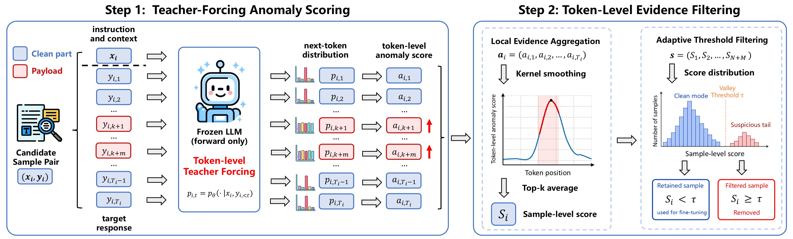

# TTAF

Code release for **Leveraging Teacher-Forcing Token-Level Anomaly
Signals for Heterogeneous Backdoor Filtering in LLMs**.

## Overview



TTAF (Teacher-Forcing Token-Level Anomaly Filtering) detects suspicious instruction-tuning samples before fine-tuning. It scores localized target-token anomalies under teacher forcing, smooths the token-level signal, and aggregates the strongest local evidence into a sample-level filtering score.

This repository intentionally provides the smallest paper-facing workflow: the Word-trigger attack, TTAF detection/filtering, and the four question-answering datasets used in the paper. The implementation is adapted from GraCeFul and OpenBackdoor; see [THIRD_PARTY_NOTICES.md](THIRD_PARTY_NOTICES.md).

## Included

- `casualDefense.py`: main detection, filtering, training, and evaluation entry point;
- `genConfigs/TTAF.json`: default TTAF and Llama-2-7B-Chat configuration;
- `openbackdoor/`: local framework code required by the main workflow;
- `datasets/QuestionAnswering/`: processed WebQA, FreebaseQA, NQ, and CoQA splits;
- `requirements.txt`: dependencies for the minimal workflow.

The minimal source tree and registries contain only the causal-LM victim,
Word-trigger poisoner, TTAF defender, causal trainer, and QA data pipeline needed
by the supported command.

## Requirements

- Python 3.10 is recommended;
- a CUDA-capable GPU for the default 7B model;
- access to `meta-llama/Llama-2-7b-chat-hf`, or equivalent local weights.

The paper experiments used two NVIDIA A800 80 GB GPUs. Hardware requirements may
vary with model placement and precision.

Create an environment and install dependencies:

```bash
python -m venv .venv
source .venv/bin/activate
python -m pip install --upgrade pip
python -m pip install -r requirements.txt
```

On Windows PowerShell:

```powershell
python -m venv .venv
.venv\Scripts\Activate.ps1
python -m pip install --upgrade pip
python -m pip install -r requirements.txt
```

If the Hugging Face model is gated, request access on its model page and log in
with the Hugging Face CLI before running the command.

## Data

The processed experimental subsets are already included:

| Dataset | Train | Dev | Test |
| --- | ---: | ---: | ---: |
| WebQA | 3,401 | 377 | 2,032 |
| FreebaseQA | 5,000 | 400 | 2,000 |
| NQ | 5,000 | 400 | 2,000 |
| CoQA | 5,000 | 400 | 498 |

WebQA stores 3,778 training examples on disk; the loader deterministically
creates the 3,401/377 train/dev split using `dev_rate=0.1`. Dataset provenance
and license information are documented in [datasets/README.md](datasets/README.md).

## Detection-Only Main Flow

Run commands from the repository root. Detection-only mode performs poisoning
and TTAF filtering without downstream fine-tuning:

```bash
CUDA_VISIBLE_DEVICES=0 python casualDefense.py \
  --config_path ./genConfigs/TTAF.json \
  --dataset webqa \
  --poisoner word \
  --attack_mode internal \
  --poison_rate 0.10 \
  --seed 42 \
  --detect_only
```

Windows PowerShell:

```powershell
$env:CUDA_VISIBLE_DEVICES="0"
python casualDefense.py --config_path ./genConfigs/TTAF.json --dataset webqa --poisoner word --attack_mode internal --poison_rate 0.10 --seed 42 --detect_only
```

## Full Main Flow

Remove `--detect_only` to filter the poisoned training set, fine-tune on the
retained samples, and evaluate clean accuracy (CACC) and attack success rate
(ASR):

```bash
CUDA_VISIBLE_DEVICES=0 python casualDefense.py \
  --config_path ./genConfigs/TTAF.json \
  --dataset webqa \
  --poisoner word \
  --attack_mode internal \
  --poison_rate 0.10 \
  --seed 42
```

## Paper-Aligned Naming

- `--poisoner word` denotes the Word-trigger attack;
- `--attack_mode internal` denotes internal target-side payload insertion;
- the other supported payload placements are `append`, `prefix`, and `rewrite`.

For backward compatibility, `--poisoner genbadnets_question` and
`--attack_mode keyword` are accepted and normalized to the paper-facing labels
`word` and `internal` in result names and TTAF metadata. The underlying Word
attack uses the existing BadNets-style word-trigger implementation.

## Outputs

Detection-only results:

```text
outputResults/detect_only/<run-name>/
├── detectOutput.json
├── detectSummary.json
└── time.json
```

Full-run results:

```text
outputResults/full/<run-name>/
├── summary.json
├── summary.txt
├── testOutput.json
└── time.json
```

TTAF feature artifacts currently retain the legacy filename for backward
compatibility:

```text
leaf/<dataset>/word/<timestamp>/leaf_features.pkl
```

Generated model weights, poisoned-data caches, result files, and feature
artifacts are excluded by `.gitignore`.

## Citation

The final archival URL and camera-ready BibTeX will be added after publication.
Until then, please cite the paper by its full title:

> Leveraging Teacher-Forcing Token-Level Anomaly Signals for Heterogeneous
> Backdoor Filtering in LLMs.

## License

The repository-level license is GPL-3.0. Included datasets remain subject to
their original licenses and terms; see [datasets/README.md](datasets/README.md).
Third-party code attribution is listed in
[THIRD_PARTY_NOTICES.md](THIRD_PARTY_NOTICES.md).
